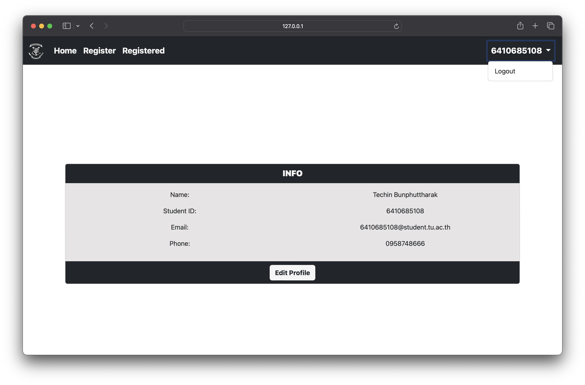

# cn331-as2
## สมาชิก
1.นายกรวัชร์ เปลี่ยนสุวรรณ 6410685066\
2.นายเฏชินท์ บุญพุทธรักษ์ 6410685108

## วิดีโอสอนการใช้งาน
https://www.youtube.com/watch?v=prCK3ghUIAw

## วิธีใช้การ

หน้านี้คือเอาไว้สำหรับการเข้าสู่ระบบ

### Login By User General

จะมาที่หน้าหลักของเว็บซึงจะมีให้เราใช้งานได้หลายอย่าง
* Register
* Registered
* Edit Profile
* Logout
โดยเราสามารถออกจากระบบโดยการกด Logout ทางขวาบน
#### Register

จะเป็นหน้าที่เราะใช้ในการขอโควต้าโดยจะมีรายวิชาทั้งหมดรวมถึงบอกว่ามีจำนวนที่จะขอโควต้าเหลือเท่าไหร่รวมถึงสถานะของรายวิชานั้นว่าเปิดหรือปิดการขอโควต้าอยู่ ถ้าต้องการขอโควต้าวิชาไหนให้ทำการกดปุ่ม Apply
#### Registered

ในหน้านี้จะเป็นรายวิชาทั้งหมดที่ User คนนั้นทำการขอโควต้าได้โดยเราสมารถยกเลิกการขอโควต้าได้โดยการกดปุ่ม Cancel
#### Edit Profile

โดยในหน้าเราจะสามารถแก้ไขข้อมูลส่วนตัวได้
* ชื่อ-นามสกุล 
* Email 
* เบอร์โทร

### Login By Admin

ระบบจะนำพามายังหน้า admin ของ django
#### Subjects

Admin สามารถทำการเพิ่มรายวิชาได้โดยใส่ชื่อวิชา รหัสวิชา เทอมที่เปิด ปีการศึกษา จำนวนที่สามารถลงได้ จำนวนรับสมัครทั้งหมด 

โดยในหน้านี้สามารถดูได้ที่ข้างล่างว่าในวิชาที่เรากดเข้ามาดูหรือแก้ไขนี้มี User ใดขอโควต้าบ้าง
#### Users

ในหน้านี้ Admin สามารถเพิ่มหรือลบ User ต่าง ๆ รวมถึงแก้ไขข้อมูลต่าง ๆ ของ User ได้
#### ListRegSubjects

ในหน้านี้ Admin สามารถดูได้ว่า User คนไหนลงวิชาอะไรหรือวิชาไหนมี User ไหนลงโดย
* ถ้าอยากดูว่ารายวิชานี้มี User คนไหนขอโควต้าบ้างให้ทำการ Search ID ของรายวิชานั้น 
* ถ้าอยากดูว่า User คนนี้ลงรายวิชาไหนบ้างให้ Search ID ของ User

